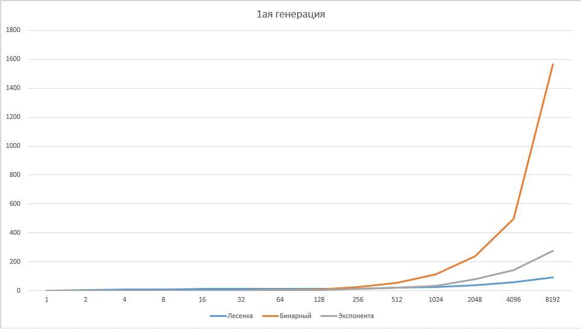
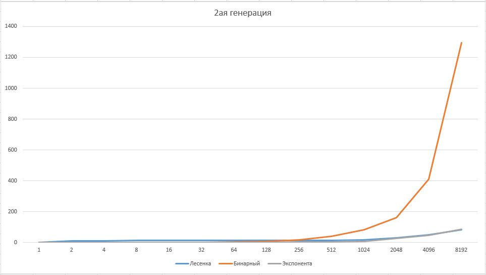

# **AlgorithmLab1** 
**Цель:** Сравнение Алгоритмов Лесенки, Бин поиска, Эскп поиска.  
**Выполнил:** Трясков Алексей 22ПИ-2  
**Язык:** C++
___
# Реализация 3х алгоритмов
**Алгоритм лесенки**  
Идём из правого верхнего угла, сравнивая текущий элемент с **target**. Если текущий **> target** - идём влево. Если он **< target** - идём вниз. Иначе - **target** найден.  
Действуем пока не выйдем за границы матрицы.

```C++
// Лесенка

bool Search_1(int** arr, int target) {
    int i = 0, j = N - 1;
    while (i < M && j >= 0) {
        if (target < arr[i][j]) {
            //left
            j--;
        }
        else if (target > arr[i][j]) {
            //down
            i++;
        }
        else {
            return true;
        }
    }
    return false;
}
```

**Сложность:** O(N+M)  
___
**Алгоритм бинарного поиска в матрице**  
Для каждой строки запускаем алгоритм бинарного поиска.  

```C++
// Бинарный поиск

bool Search_2(int** arr, int target) {
    for (int i = 0; i < M; i++) {
        if (binSearch(arr[i], target, 0, N - 1)) {
            return true;
        }
    }
    return false;
}
```

Бинарный поиск:  
Смотрим центральный элемент массива. Если он **< target** - рассматриваем левый подмассив. Если **> target** - правый. Иначе **target** найден.  
Идём пока длина массива индекс левой части массива <= правой.

```C++
bool binSearch(int* arr, int target, int left, int right) {
    while (left <= right) {
        int mid = (right - left) / 2 + left;
        if (arr[mid] == target) {
            return true;
        }
        else if (arr[mid] < target) {
            left = mid + 1;
        }
        else {
            right = mid - 1;
        }
    }
    return false;
}
```

**Сложность:** O(M*log(N))
___
**Алгоритм экспоненциального поиска в матрице**  
Также как и в алгоритме лесенкой по вертикали идем обычным линейным шагом. По горизонтали перемещаемся экспоненциальным поиском.

```C++
// Эксп поиск

bool Search_3(int** arr, int target) {
    int i = 0, j = N - 1;
    while (i < M && j >= 0) {
        if (target < arr[i][j]) {
            //left
            j = expSearch(arr[i], target, j);
        }
        else if (target > arr[i][j]) {
            //down
            i++;
        }
        else {
            return true;
        }
    }
    return false;
}
```

Экспоненциальный поиск:  
Идем по массиву по степеням двойки, пока наш элемент **> target**. После - вызываем бинарный поиск на полученном отрезке.

```C++
int expSearch(int* arr, int target, int index) {
    int step = 1;
    int left = 0, right = 0;
    while (index >= 0) {
        if (arr[index] > target) {
            index -= step;
            step *= 2;
        }
        else if (arr[index] == target) {
            return index;
        }
        else {
            left = index;
            right = step / 2 + index;
            break;
        }
    }
    if (index < 0) {
        left = 0;
        right = step / 2 + index;
    }
    while (left <= right) {
        int mid = (right - left) / 2 + left;
        if (arr[mid] == target) {
            return mid;
        }
        else if (arr[mid] < target) {
            left = mid + 1;
        }
        else {
            right = mid - 1;
        }
    }
    return left - 1;
}
```

**Сложность:** O(M*(log(N)-log(M)+1))  

___  
# Реализация 2х генераций
**1ая генерация**  

Arr[i][j] = (N / M * i + j) * 2  
target = 2 * N + 1

```C++
void Fill_Arr_1(int** arr, int* target) {
    for (int i = 0; i < M; i++) {
        for (int j = 0; j < N; j++) {
            arr[i][j] = (N / M * i + j) * 2;
        }
    }
    (*target) = 2 * N + 1;
}
```

**2ая генерация**

Arr[i][j] = (N / M * i* j) * 2  
target = 16 * N + 1

```C++
void Fill_Arr_2(int** arr, int* target) {
    for (int i = 0; i < M; i++) {
        for (int j = 0; j < N; j++) {
            arr[i][j] = (N / M * i * j) * 2;
        }
    }
    (*target) = 16 * N + 1;
}
```

# Что нужно для запуска


Для запуска необходимо скачать файл с кодом и расширением **.cpp** и запустить его с помощью заранее установленного **C++** компилятора. 

Переходим в папку с файлом

```cmd
cd "путь к папке"
```

Создаём **.exe** файл

```cmd
g++ AlgorithmLab1.cpp
```

Запускаем созданный файл

```cmd
a.exe
```
Также возможно просто скачать уже готовый файл **a.exe**.
# Результаты запусков
Результат, который выдаст программа:

```
1st generation
M Ladder Binary Exponential
1 0.0428 0.0933 0.0428
2 6.6187 0.1418 0.1162
4 10.1926 0.2448 0.4267
8 11.7969 0.4652 0.5381
16 12.8675 0.9101 1.0333
32 13.5365 1.8045 1.9086
64 14.1405 5.391 3.4862
128 15.1912 11.8577 6.0936
256 14.2993 28.8846 10.7637
512 21.7151 63.0767 18.8999
1024 23.0342 129.026 34.9802
2048 38.698 296.073 82.079
4096 58.5792 695.741 146.681
8192 92.0101 1854.81 267.26
2nd generation
M Ladder Binary Exponential
1 0.042 0.0925 0.0422
2 13.2776 0.1405 0.1213
4 13.2545 0.2411 0.1756
8 13.3031 0.4509 0.2622
16 13.3561 0.8864 0.4225
32 13.4153 1.7363 0.6629
64 13.6863 3.786 1.0299
128 13.9736 8.7135 1.6877
256 14.8889 17.9281 2.7401
512 15.3397 43.0584 4.6194
1024 18.1005 87.5711 8.2467
2048 33.029 176.661 26.3559
4096 49.5447 502.355 46.8514
8192 85.6321 1504.96 85.7827
```


Здесь можно увидеть время работы алгоритмов при 2х генерациях и всех значениях **M**.

Результат представлен в микросекундах.

# Визуализация

**1ая генерация**



Используя первый способ генерации, самым эффективным алгоритмом оказывается лесенка. При M <= 256 алгоритмы работают примерно за одинаковое время, однако на больших данных лучший - лесенка, худший - бинарный поиск. При M <= 1024 лесенка и экспонента работают примерно одинаково.

**2ая генерация**



При второй генерации худшим также оказался бинарный поиск. Однако точно определить лучший нельзя. Лесенка и экспонента работают примерно одинаково при любом M.

# Выводы
Подводя итог, можно сказать, что худшим по времени оказался бинарный поиск. Это связано с тем что он всегда работает за **M*log(N)**, и из-за этого различия в генерациях никак на нём не отражаются. При M = 8192 он всегда работает приблизительно за 1500-1800 микросекунд.

Самым же стабильным и универсальным оказался алгоритм лесенки, ведь в отличии от бинарного, он в худшем случае пройдет всего лишь **M+N**. Из-за его простоты, разница генераций на него не сильно повлияла.

Говоря про экспоненциальный поиск, нужно отметить, что он сильно зависит от исходных данных. Он не такой стабильный как лесенка, но при некоторых генерациях, может наравне с ней конкурировать. Такой пример мы видим при 2ой генерации.

*Все графики можно найти в файле graph.xlsx*
